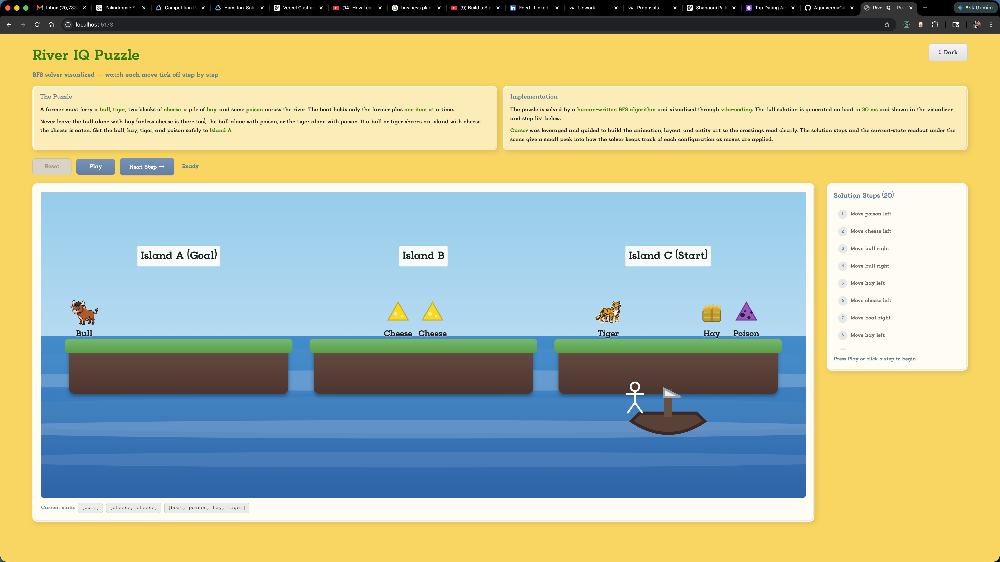

# 🌊 River IQ Puzzle

**[▶️ Play it live on Vercel](https://river-iq-q31.vercel.app)**

A river-crossing brain teaser — solved by a human-written **BFS algorithm**, brought to life with **vibe-coding** in Cursor.



---

## 🧩 What’s the puzzle?

Three islands (**A**, **B**, **C**) sit in a river. A farmer in a small boat must move everyone from the starting side to **Island A (the goal)**.

**Passengers & cargo:**

- 🐂 Bull  
- 🐯 Tiger  
- 🧀 Two blocks of cheese  
- 🌾 Hay  
- ☠️ Poison  

**Starting layout:**

| Island | Who’s there |
|--------|-------------|
| **A** | Bull |
| **B** | Two cheeses |
| **C** | Farmer + boat, poison, hay, tiger |

---

## 📜 Rules & constraints

Read these carefully — most “impossible” moves come from breaking one of them.

### 🚤 Boat capacity

- The boat always carries the **farmer**.
- The farmer can take **at most one other thing** per crossing (one animal, one cheese, hay, poison, or an empty trip).
- The farmer must be in the boat for every move — you can’t leave the boat behind on an island without them.

### 👀 “Unattended” means the farmer isn’t there

An island is **unattended** when the **boat (farmer) is not on that island**.  
Rules below only apply when people or items are left alone without the farmer.

### 🚫 Forbidden pairings (instant disaster if left unattended)

These combinations may **never** be left on the same island without the farmer:

| Left alone together | What happens |
|---------------------|--------------|
| 🐂 **Bull + 🌾 hay** (and **no cheese**) | The bull eats the hay — **invalid state** |
| 🐂 **Bull + ☠️ poison** | The bull takes the poison — **invalid state** |
| 🐯 **Tiger + ☠️ poison** | The tiger takes the poison — **invalid state** |

> **Exception for bull + hay:** Bull and hay **can** share an island **only if at least one cheese is also present** on that island. The cheese acts as bait and keeps the bull from eating the hay.

### 🧀 Cheese is bait — and gets eaten

Cheese doesn’t stop bull/tiger forever. If cheese shares an island with a predator **while the farmer is away**:

| Left unattended together | What happens |
|--------------------------|--------------|
| 🐂 **Bull + 🧀 cheese** | The bull eats **one** block of cheese (it disappears from the island) |
| 🐯 **Tiger + 🧀 cheese** | The tiger eats **one** block of cheese (it disappears from the island) |

- Only **one** cheese is eaten per island per move.
- If two cheeses are on the same island with a bull or tiger, they are eaten one at a time over successive unattended moments.
- Cheese does **not** need to reach Island A to win — it can be sacrificed as bait along the way.

### 🏁 Win condition

You win when **Island A** contains **all four**:

- 🐂 Bull  
- 🐯 Tiger  
- 🌾 Hay  
- ☠️ Poison  

(Cheese is optional at the end — the solver only requires those four on the goal island.)

---

## 🧠 How it’s built

| Part | Who built it |
|------|----------------|
| **Solver** (`src/solver.js`) | Human-written BFS |
| **Visualizer** (React + animations) | Vibe-coded in Cursor, guided by a human |

The solver searches the state tree (2–4 branches per move). Brute force would be roughly **2²⁰ ≈ 1 million** paths. BFS finds the full **20-move solution in ~31 ms** when the app loads.

The **step list** on the right and the **current state** chips under the scene show how each island configuration is tracked move by move.

---

## ✨ Features

- 🎬 **Play / Pause / Next Step / Reset** — watch the solution unfold  
- 👆 **Click any step** to jump to that point  
- 🚤 **Animated boat crossings** with custom icons  
- 🏝️ **Three islands** over animated water  
- 🌙 **Dark mode** toggle  
- 📍 **Stable entity positions** — items don’t shuffle when neighbors move  

---

## 🐛 Known rough edges

Honest list of things that still aren’t perfect:

- 🧀 **Cheese eaten off-screen** — when bait is consumed, a cheese vanishes from the state array but there’s no dedicated “chomp” animation yet  
- 📋 **State array vs. visuals** — the solver sorts island contents alphabetically after some moves; the UI uses fixed slots per entity, so the picture and the raw `[bull, cheese, …]` chips can look slightly different in ordering  
- 🏷️ **Duplicate labels** — two cheeses both read “cheese” under their icons (no “cheese 1 / cheese 2” distinction)  
- 📱 **Small screens** — the scene and step panel stack, but controls and island labels can feel cramped on narrow phones  
- ⚡ **BFS is invisible** — the search finishes in ~31 ms on load; you only ever see the *answer*, not the *search*  

---

## 🔮 What could be added next

### 🧭 The big open question: what should this app *be*?

Right now it’s a **solution replay** — BFS runs once, you watch the optimal 20 moves. That’s great for understanding *what* to do, but it skips *how the computer figured it out* and *whether you could do it yourself*.

Three directions pull in different ways:

| Mode | What you’d see | Pros | Cons |
|------|----------------|------|------|
| **📽️ Solution replay** *(current)* | The winning path, step by step | Clear, fast, matches “here’s the answer” | Hides the algorithm entirely |
| **🔍 BFS explorer** | Queue growing, states tried, dead ends pruned — slowed down or scrubbable | Actually teaches BFS; fits the “human algorithm + AI viz” story | ~31 ms is too fast to watch live; needs artificial delay, a tree/graph view, or a “states visited” counter |
| **🎮 Human play** | You pick moves; app validates rules | Interactive, satisfying if you solve it | Competes with the demo — if you just want to *play*, you don’t need a pre-baked solver |

**A plausible split (not built yet):** keep replay as the default, add an optional **“Watch BFS search”** tab that animates the queue (even at 50–200 ms per state explored) and highlights when a state is rejected vs. enqueued — then snap to the shortest path when done. Human play could live behind a **“Try it yourself”** toggle so it doesn’t replace the algorithm demo.

### ✨ Feature ideas

**Algorithm & learning**

- 🔍 **BFS search replay** — step through *exploration*, not just the final path; show visited count, queue size, rejected states  
- 📊 **Solver stats panel** — states explored, memo hits, time per phase, tree depth  
- 🌳 **State graph view** — tiny node graph of parent → child configurations (collapsible; this puzzle’s graph is manageable)  
- ⏱️ **Speed control** — slow auto-play way down so crossings *and* search steps are followable  

**Gameplay (optional second mode)**

- 🎮 **Try-it-yourself mode** — click an item to ferry; illegal moves blocked with an explanation  
- ⚠️ **Rule callouts** — “bull would eat hay here” before you commit a move  
- 🏆 **Your moves vs. optimal** — after you win (or give up), compare length to the 20-move BFS answer  

**Polish**

- 🧀 **Cheese-eating animation** — visual feedback when bait is consumed  
- 🔀 **Alternate starting layouts** — reshuffle islands and re-run BFS  
- 🔊 **Sound** — water, boat, win chime  
- 🌍 **Shareable links** — open directly at step *N*  
- 📱 **Mobile layout pass** — larger tap targets, simplified header on small viewports  

### 🐞 Bugs worth fixing

- Cheese disappearance should be animated and tied to the correct cheese identity  
- Align state readout ordering with visual slot order (or drop sorting in `applyMove` for display states)  
- Disambiguate two cheeses in labels and in move history (“Move cheese #1 left”)  

---

## 🚀 Run locally

```bash
npm install
npm run dev
```

Open the URL in your terminal (usually `http://localhost:5173`).

### Build for production

```bash
npm run build
```

---

## 🖥️ Original CLI solver

Before the visualizer, the puzzle ran in the terminal:

```bash
node riveriq.js
```

---

## 🛠️ Stack

- **React** + **Vite**  
- **BFS** in plain JavaScript  
- Hosted on **[Vercel](https://river-iq-q31.vercel.app)**

---

Made with 🧀, ☕, and a lot of backtracking.
